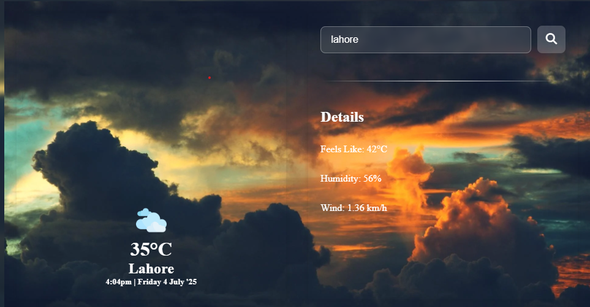

# 🌤️ Weather App

A simple and responsive weather application built using **React** and the **OpenWeatherMap API**. Users can search for real-time weather data by city name, including temperature, humidity, weather conditions, and more.

## 🚀 Live Demo
[View Live App](https://noor-1457.github.io/Weather-app/) 

## 🔧 Features
- 🌍 Search weather by city
- 🌡️ Displays temperature, humidity, and conditions
- 🎨 Responsive UI for all screen sizes
- ⚠️ Error handling for invalid locations

## 🛠️ Technologies Used
- React
- JavaScript (ES6)
- OpenWeatherMap API
- HTML5 & CSS3

## 📸 Screenshots
<!-- Add a screenshot or demo GIF -->


## 🧪 Getting Started

### Installation

```bash
git clone https://github.com/noor-1457/Weather-app.git
cd Weather-app
npm install

